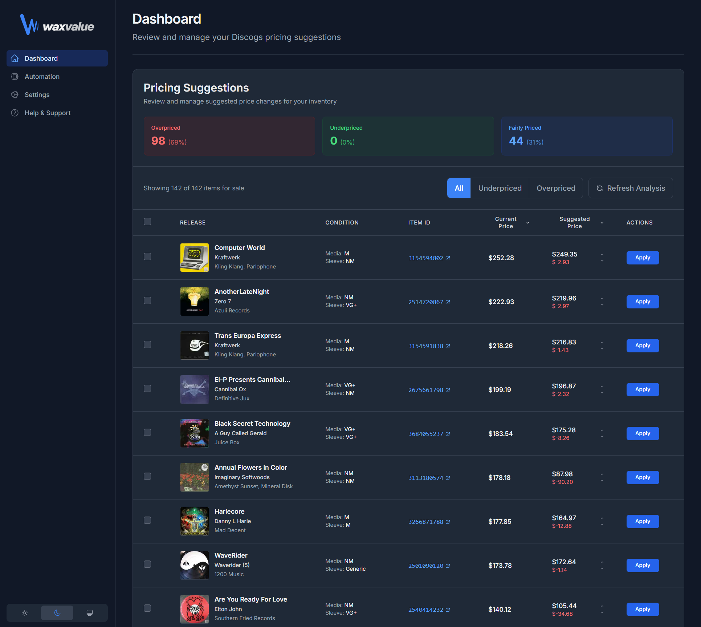

<div align="center">

# Waxvalue


### Keep your Discogs prices in sync with the market


---

</div>

A professional web application that helps Discogs sellers optimise their pricing using real-time market data analysis. Connect your Discogs account, analyse your entire inventory, and adjust prices in bulk with one click.

---

<div align="center">



</div>

---

## 🎯 What is Waxvalue?

Waxvalue connects to your Discogs account and analyses your entire inventory against current market data. It identifies underpriced and overpriced items, then lets you adjust prices in bulk with one click.

**Key benefits:**
- 📊 **Scan your entire catalogue** for mispriced items
- 💰 **Identify underpriced items** leaving money on the table
- ⚡ **Update prices in bulk** with visual confirmation
- 🎨 **Beautiful, responsive interface** with dark mode
- 🔒 **Secure OAuth integration** - never stores your password

---

## ✨ Features

### Core Functionality

| Feature | Description |
|---------|-------------|
| **Discogs OAuth Integration** | Secure authentication with Gravatar avatar support |
| **Real-time Analysis** | Server-Sent Events (SSE) streaming for live progress |
| **Smart Pricing** | Condition-specific recommendations based on market data |
| **Bulk Operations** | Apply or decline multiple price changes at once |
| **Advanced Filtering** | Filter by status, condition, price range with persistence |
| **Smart Sorting** | Default sort by price delta (underpriced items first) |

### User Experience

- 🎓 **Loading screen** - 65 randomised vinyl facts to educate while processing
- ✨ **Visual feedback** - Animated row repositioning with 2-second green highlight
- 💾 **Settings persistence** - Filters and preferences saved across sessions
- 📱 **Responsive design** - Optimised for desktop, tablet, and mobile
- 🌙 **Dark mode** - Full dark theme support
- 🇬🇧 **British English** - Proper spelling and grammar throughout

### Landing Page

- Modern, responsive design with animated gradients
- Edge-to-edge hero imagery
- Single call-to-action (Connect with Discogs)

---

## 🚀 Quick Start

### Local Development

**Prerequisites:**
- Node.js 18+
- Python 3.11+
- Git

**Installation:**

```bash
# Clone repository
git clone https://github.com/deepdesign/waxvalue.git
cd waxvalue

# Install dependencies
npm install
cd backend && pip install -r requirements.txt && cd ..

# Start servers (Windows)
.\start-servers.ps1

# OR start manually:
# Terminal 1 - Frontend
npm run dev

# Terminal 2 - Backend
cd backend
python main-dev.py
```

**Access:**
- Frontend: http://localhost:3000
- Backend API: http://localhost:8000
- API Docs: http://localhost:8000/docs

---

## 📦 Production Deployment

Waxvalue is production-ready and tested. See deployment guides:

- **[Hostinger VPS Deployment](docs/deployment/HOSTINGER_VPS_DEPLOYMENT.md)** - Complete VPS setup guide
- **[Quick Deploy Guide](docs/deployment/DEPLOY_INSTRUCTIONS.md)** - Step-by-step deployment
- **[Environment Setup](docs/ENV_TEMPLATE.md)** - Required environment variables

**One-line deploy** (after uploading files):
```bash
bash deploy-final.sh
```

---

## 🛠 Technology Stack

### Frontend
- **Framework:** Next.js 15.5.4 (React 19)
- **Language:** TypeScript
- **Styling:** Tailwind CSS with TailAdmin theme
- **State:** React Context API + localStorage
- **Icons:** Heroicons
- **Notifications:** react-hot-toast

### Backend
- **Framework:** FastAPI (Python)
- **API Integration:** Discogs OAuth 1.0a
- **Sessions:** File-based (sessions.json)
- **Streaming:** Server-Sent Events (SSE)
- **Rate Limiting:** Token bucket algorithm

### Infrastructure
- **Hosting:** Hostinger VPS or similar
- **Web Server:** Nginx (reverse proxy)
- **Process Manager:** PM2
- **SSL:** Let's Encrypt (Certbot)

---

## ⚙️ Configuration

### Backend Environment (`backend/.env`)

```bash
DISCOGS_CONSUMER_KEY=your_consumer_key
DISCOGS_CONSUMER_SECRET=your_consumer_secret
FRONTEND_URL=https://yourdomain.com
CORS_ORIGINS=https://yourdomain.com
SESSION_SECRET=your_random_secret_key
LOG_LEVEL=INFO
```

### Frontend Environment (`.env.production`)

```bash
NEXT_PUBLIC_BACKEND_URL=https://yourdomain.com/api/backend
```

See [docs/ENV_TEMPLATE.md](docs/ENV_TEMPLATE.md) for complete configuration.

---

## 📚 Documentation

### Getting Started
- [Quick Start Guide](#-quick-start)
- [Environment Setup](docs/ENV_TEMPLATE.md)
- [Development Guidelines](docs/development/DEVELOPMENT_GUIDELINES.md)

### Deployment
- [Hostinger VPS Guide](docs/deployment/HOSTINGER_VPS_DEPLOYMENT.md)
- [Deployment Instructions](docs/deployment/DEPLOY_INSTRUCTIONS.md)
- [Pre-Deployment Tests](docs/deployment/PRE_DEPLOYMENT_TEST_REPORT.md)

### Development
- [API Documentation](docs/API.md)
- [Testing Guide](docs/development/TESTING_GUIDE.md)

### Reference
- [Security Checklist](docs/security/SECURITY_CHECKLIST.md)

---

## 🎨 Features in Detail

### Pricing Analysis
- Fetches all "For Sale" items from your Discogs inventory
- Uses Discogs' official price suggestion API
- Matches exact item condition (media + sleeve) to market data
- Classifies as underpriced (10%+ higher), overpriced (10%+ lower), or fairly priced
- Real-time progress with Server-Sent Events

### Apply Flow
1. User clicks "Apply" → Button turns green with checkmark
2. 2-second pause for visual confirmation
3. Row smoothly animates to new sorted position (200ms transition)
4. Applied rows show subtle green tint

### Filtering and Sorting
- Filter by status, condition, price range
- Default sort: underpriced items first (largest delta to smallest)
- Filters persist across browser sessions
- Real-time filter count display

---

## 🔧 Development

### Scripts

```bash
npm run dev          # Start development server (Turbopack)
npm run build        # Build production bundle
npm start            # Start production server
npm run lint         # Run ESLint
npm run type-check   # TypeScript validation
```

### Project Structure

```
waxvalue/
├── src/
│   ├── app/              # Next.js pages and API routes
│   ├── components/       # React components
│   ├── contexts/         # React context providers
│   ├── lib/              # Utility functions
│   └── types/            # TypeScript definitions
├── backend/
│   ├── main.py           # FastAPI production server
│   ├── main-dev.py       # Development server
│   └── discogs_client.py # Discogs API integration
├── public/
│   ├── images/           # Landing page images
│   └── svg/              # Logo assets
├── docs/                 # Documentation
├── config/               # Production configurations
└── scripts/              # Deployment scripts
```

---

## 🧪 Testing

**Build Test:**
```bash
npm run build  # Should complete with 31 pages generated
```

**Local Test:**
```bash
.\start-servers.ps1  # Start both frontend and backend
# Visit http://localhost:3000
# Test OAuth login and pricing analysis
```

---

## 📊 Production Statistics

- **Build Size:** 102 kB (gzipped)
- **Pages:** 31 static pages
- **API Routes:** 23 endpoints
- **Code Quality:** 0 TypeScript errors, 15 non-blocking ESLint warnings
- **Dependencies:** Up to date
- **Browser Support:** Modern browsers (Chrome, Firefox, Safari, Edge)

---

## 🔐 Security

- ✅ OAuth 1.0a authentication (no password storage)
- ✅ Session-based authentication
- ✅ CORS configured for production domains
- ✅ Environment variables for secrets
- ✅ HTTPS required for OAuth callbacks
- ✅ Rate limiting on API endpoints

---

## 📝 License

This project is licensed under the MIT License.

---

## 🆘 Support

- **Issues:** [GitHub Issues](https://github.com/deepdesign/waxvalue/issues)
- **Documentation:** [docs/](docs/) directory
- **Discogs API:** [Discogs Developer Portal](https://www.discogs.com/developers)

---

<div align="center">

## 🙏 Credits

**Development:** October 2025  
**Product designer:** [jamescutts.me](https://www.jamescutts.me)  
**Framework:** Next.js 15 + FastAPI  
**UI kit:** Tailwind CSS  
**API:** Discogs Official API  

---

**Waxvalue** - Keep your Discogs prices market-perfect. 🎵

</div>
